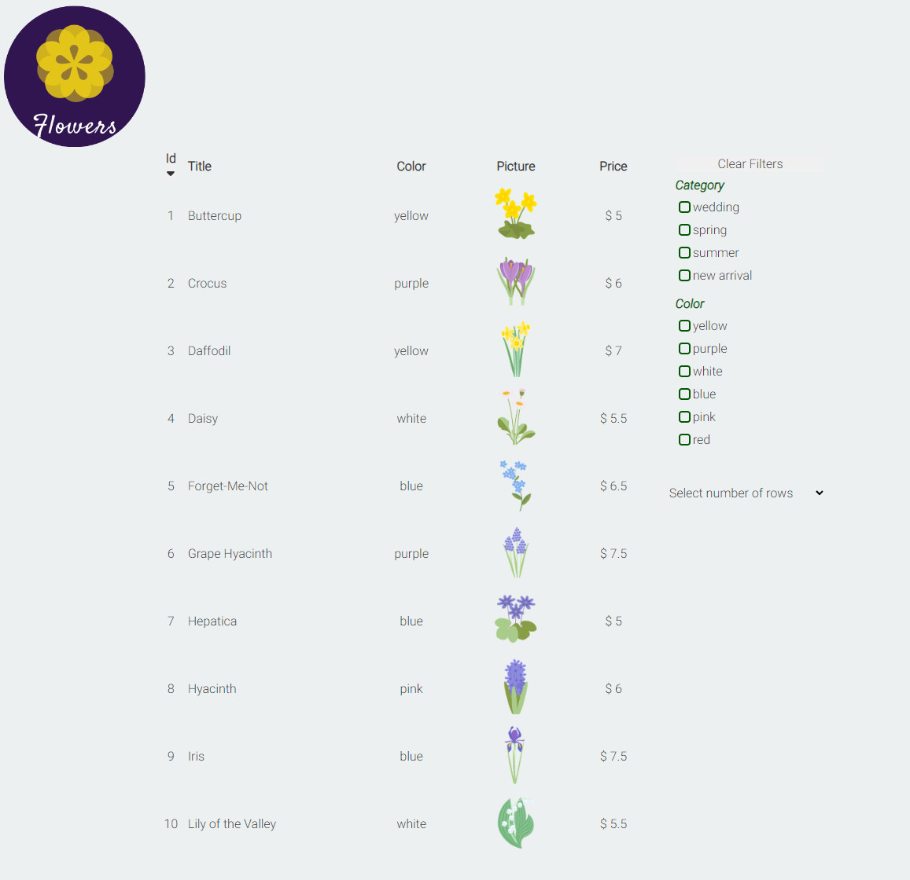
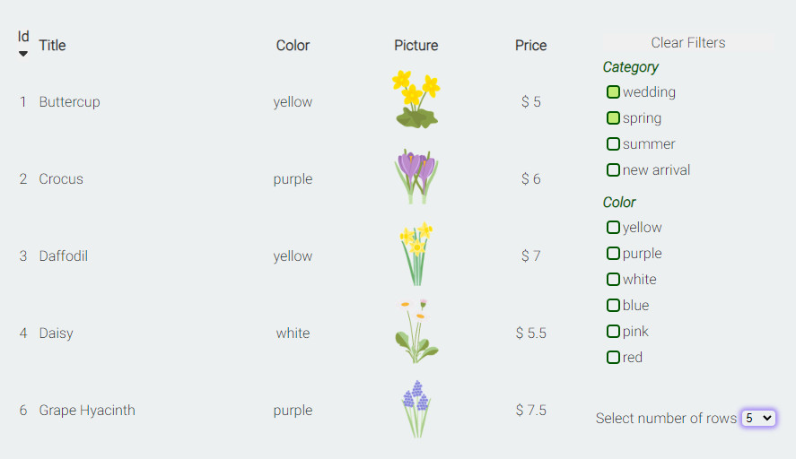
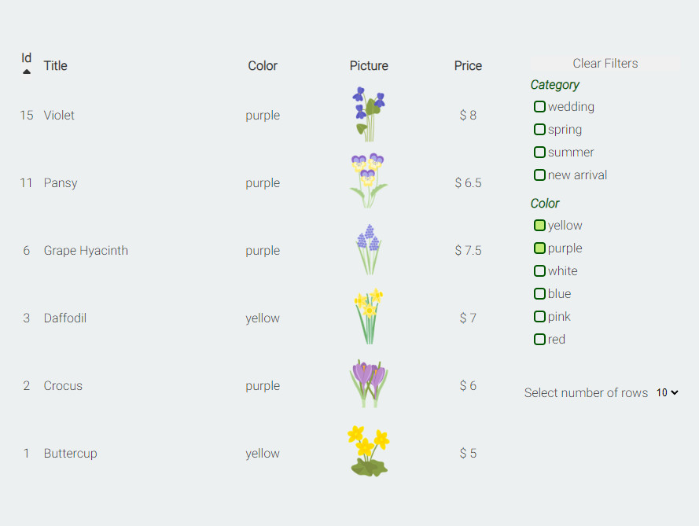
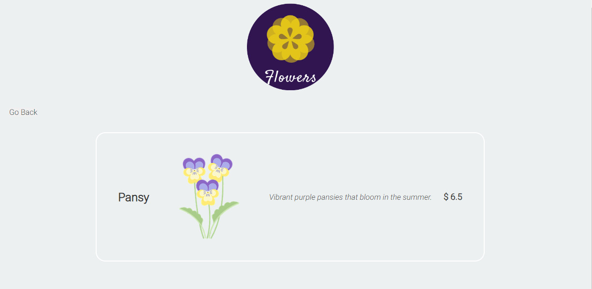
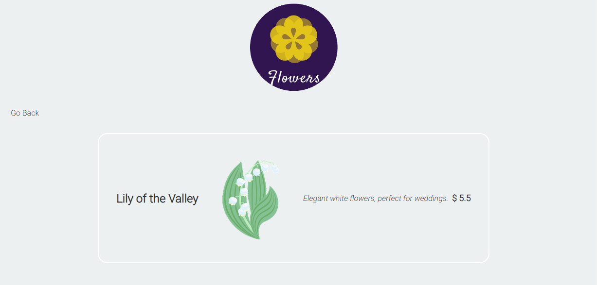

# Flowers - online shop sample

Welcome to the "Flowers" project, a basic online shop built with React!
"Flowers" is a simple yet functional online shop.
Browse through product listings, apply filters, and enjoy the convenience of sorting features.

It includes key functionality such as fetching product data, routing, and more.

## Key Features

_Homepage:_ Browse through a table of products, apply filters, and sort by various criteria.
_Product Details:_ Click on a product to view its details on a separate page using React Router.
Let's get started!

## Deeper into dev details:

- Home and Product Details pages with components like logos, buttons, and icons.
- Fetching and displaying product data from a database in a table format.
- Database simulation using json-server.
- Implementation of sorting and filtering capabilities.
- Utilization of routing for navigation between pages.
- Design was not developed for this project, it showcases the functionality only, so basic css and sample images were implemented.

The primary goal of the "Flowers" project was to enhance my Frontend coding skills. I also gained a valuable practice in testing, environment setup, including Estlint and Prettier, and version control.

Here are some screenshots of the Flower shop.

## Homepage with the logo, table of products, filters, row number selection, sortable Id and clickable titles



## Filtering



## Sorting



## Product details on a separate page (Router)




## My data base sample used in the project:

```json
{
  "flowers": [
    {
      "id": 1,
      "name": "Buttercup",
      "color": "yellow",
      "category": "wedding",
      "description": "A vibrant yellow flower, perfect for weddings.",
      "picture": "buttercup.png",
      "price": 5.0
    },
    {
      "id": 2,
      "name": "Crocus",
      "color": "purple",
      "category": "spring",
      "description": "A lovely purple flower that blooms in spring.",
      "picture": "crocus.png",
      "price": 6.0
    },
    {
      "id": 3,
      "name": "Daffodil",
      "color": "yellow",
      "category": "spring",
      "description": "Bright yellow spring flower.",
      "picture": "daffodil.png",
      "price": 7.0
    }
  ]
}
```
